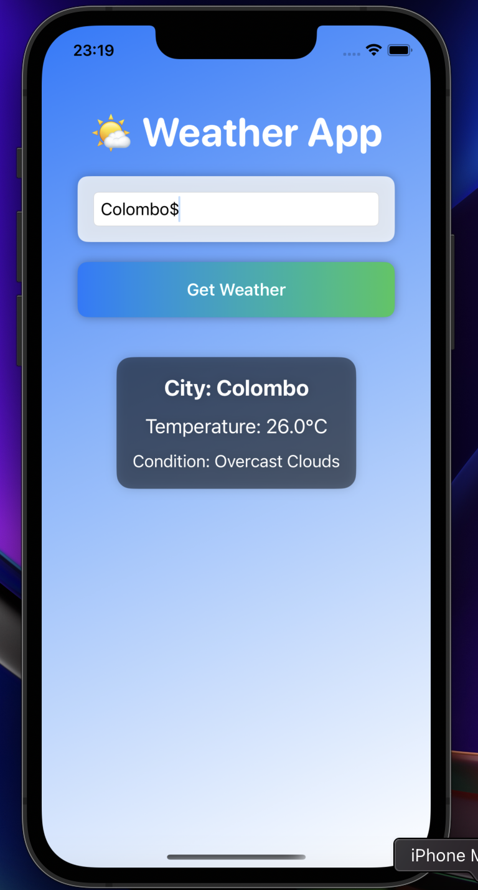

# WeatherApp 🌤☁️🌦️

A simple, elegant, and user-friendly weather app built with SwiftUI. This app provides real-time weather updates in an intuitive and modern interface, making it easy to stay informed about the weather conditions of any city.

## 🛠️ Features

- **City Weather**: Fetch real-time weather data for any city around the world.
- **Temperature Details**: Display accurate temperatures in Celsius.
- **Condition Descriptions**: Provides clear descriptions like sunny, cloudy, or rainy.
- **Modern UI**: Stylish and intuitive design with smooth animations.
- **Dark Mode Support**: Fully supports light and dark system themes.

---

## 🔄 Preview

### App Interface




---

## 🔧 Technologies Used

- **Swift**: Core programming language for iOS development.
- **SwiftUI**: Declarative UI framework for building modern apps.
- **OpenWeatherMap API**: Fetch real-time weather data.
- **Xcode**: The development environment for creating iOS apps.

---

## 🗃️ How to Use

1. **Clone the Repository:**

   ```bash
   git clone https://github.com/YourUsername/WeatherApp.git
   ```

2. **Open in Xcode:**
   - Open the `.xcodeproj` file in Xcode.

3. **Add API Key:**
   - Replace the placeholder `your_api_key` in the `fetchWeather` function with your OpenWeather API key.

4. **Run the App:**
   - Select a simulator or device in Xcode and click the ▶️ button.

---

## 🤖 UI Code Highlights

The app uses **SwiftUI**'s declarative syntax for building a clean, modern interface. Here are some highlights:

```swift
TextField("Enter City Name", text: $cityName)
    .textFieldStyle(RoundedBorderTextFieldStyle())
    .padding()

Button("Get Weather") {
    fetchWeather(city: cityName)
}
.padding()
.background(Color.blue)
.foregroundColor(.white)
.cornerRadius(8)

if let weather = weather {
    Text("City: \(weather.name)")
        .font(.title2)
    Text("Temperature: \(weather.main.temp, specifier: \"%.1f\")°C")
    Text("Condition: \(weather.weather.first?.description ?? \"\")")
}
```

---

## 🎨 Animations

Enhance the experience with weather-related animations (e.g., moving clouds, falling rain, or a shining sun). Future versions will include:

- ☀️ **Sunny**: Sun icon with glowing animation.
- ☔ **Rainy**: Droplet animation for rain.
- ⛈ **Stormy**: Flashing thunderbolt effect.

---

## 📢 Contributions

Contributions are welcome! Feel free to fork the repository, open an issue, or submit a pull request.

---

## 🔒 License

This project is licensed under the [APPtora](LICENSE).
---

## 📧 Contact

- **Developer**: Pubudu Dilshan 
- **Email**: pubududilshan97@gmail.com
- **GitHub**: [iOSDila](https://github.com/iOSDila)

### **Enjoy managing your tasks efficiently with this Weather App!**
